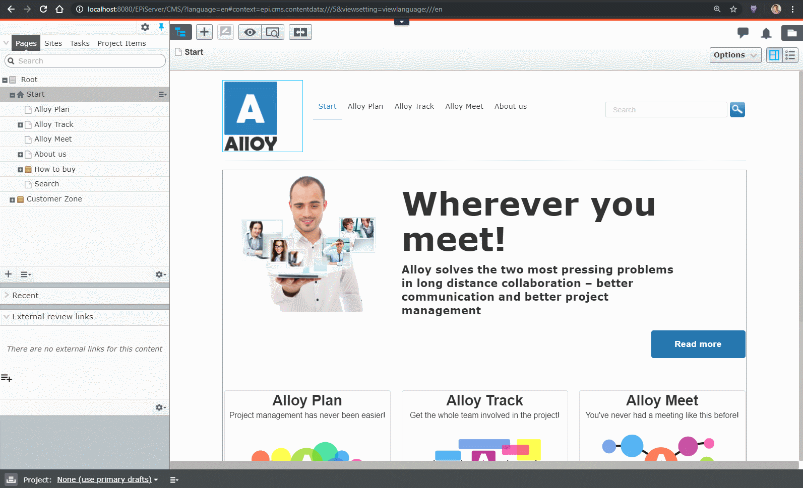
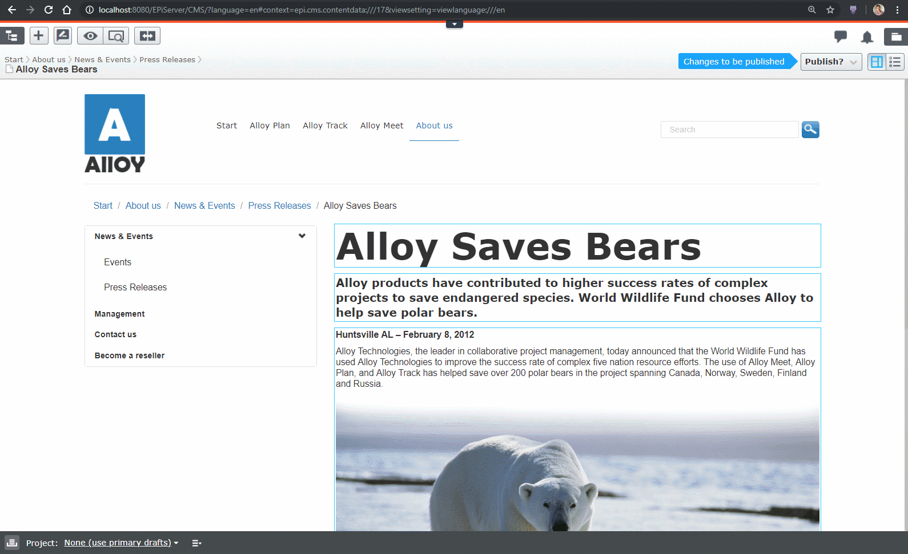
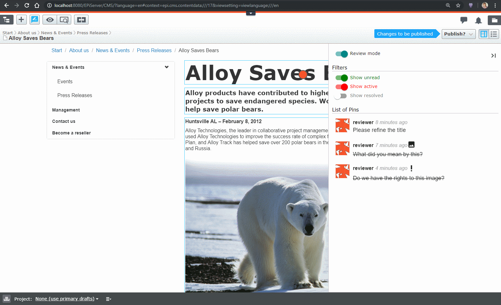
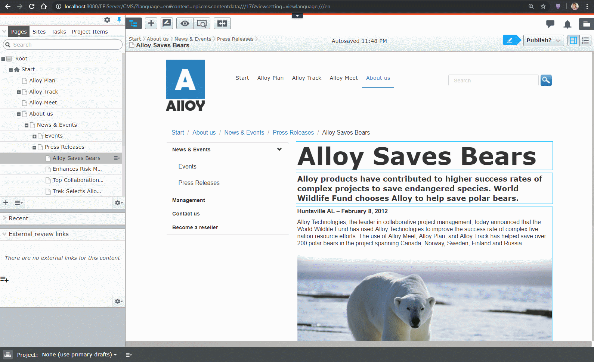
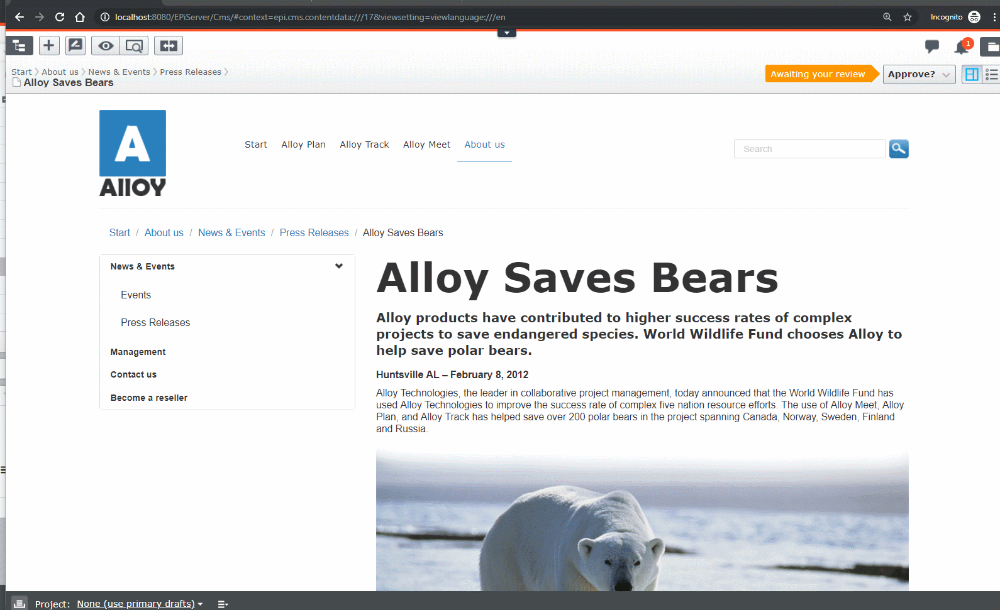
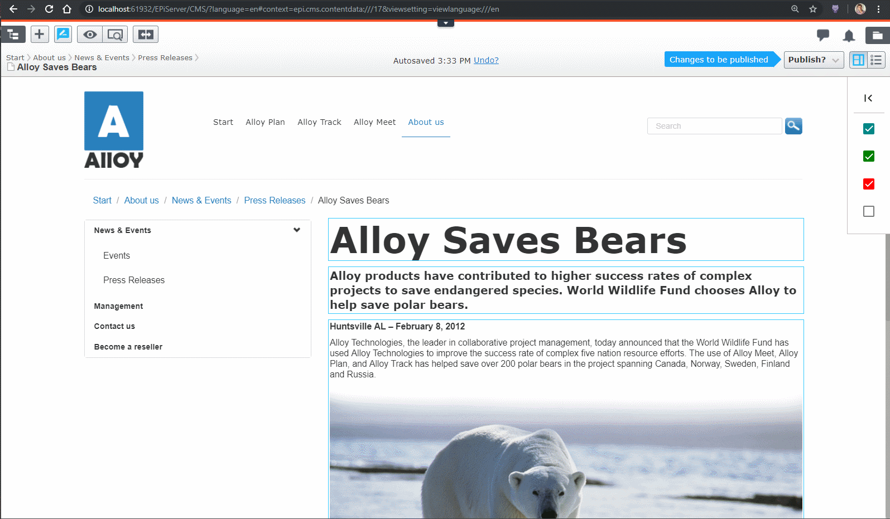
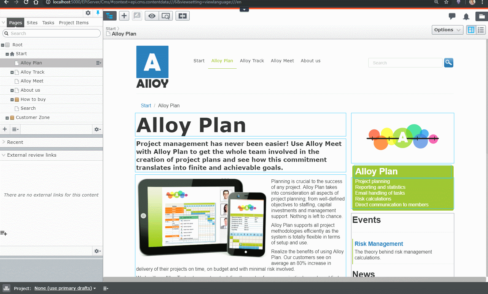

# Advanced Reviews

This project is a set of useful enhancements that may gradually improve the reviewing process in organizations using EPiServer as their CMS.

It solves a few major issues the Authors identified during their journey with EPiServer and after working on a number of EPiServer related enterprise solutions.

The list of features (click to see more details about each section):

* [Preview unpublished content](#preview-unpublished-content)
* [Preview unpublished projects](#preview-unpublished-projects)
* [Context aware smart reviewing](#context-aware-smart-reviewing) 
* [Integration with default approval workflow](#integration-with-default-approval-workflow)
* [External reviewers](#external-reviews)
* [Expirable token based urls](#expirable-token-based-urls)
* [Visual content reviews](#visual-content-reviews)

### See it in action:
[](https://www.youtube.com/watch?v=00QcfJjbdlA "Advanced Reviews")

## Install

```
Install-Package Advanced.CMS.AdvancedReviews
```

https://nuget.episerver.com/package/?id=Advanced.CMS.AdvancedReviews

## Features

### Preview unpublished content
Allow end users to preview unpublished and unreviewed content.

As we all know, an EPiServer page is usually not self-contained but rather consists of many other content items like blocks or media files.

In such scenarios it is very hard for reviewers to see the "big picture". Let's say a page consists of several blocks and a few images.
Now, in case the page author changed all those blocks and images the reviewer will have to manually go through all of them and approve them individually without, in fact, being able to see those changes in the actual page context. 

This project gives the editors a way to generate a unique URL that will present the page exactly as they see it. The preview engine will ignore content status and the content approval process.



### Preview unpublished projects
Allow end users to preview unpublished and unreviewed projects.

By default, Episerver allows the preview project only inside the Edit Mode. However, it is often useful to ask users that do not have
Edit Mode accounts to review a project before publishing.

All external review links created with the Project Mode active will allow its users to access all project content items.


### Context aware smart reviewing
In the current workflow, the reviewer can just provide a single comment that has to include all comments for a particular content version.
Then, it is the editor's responsibility to match the issues raised by the reviewer with specific parts of the page. 

This project aims at moving the comments closer to the specific page fragments which will help editors to understand & fix the issues faster.


You can also take screenshots of your page and highlight specific parts to make it clear to the editor what the concern is.


It is also important to set the priority to each comment to make it clear to the editor which comments are important and which ones are just cosmetic or optional.


After receiving such comments the author of the content will see all issues raised by the reviewer.



The author can respond to each of them individually by adding a reply message or attaching another screenshot with explanations.

Once a `Pin` is reviewed it can be marked as `Resolved` 


All pins are saved and can be reviewed at any time in a dedicated `Review pane`.



### Integration with default approval workflow

Let's say we configure a very basic approval workflow with a single approval step and a single reviewer. 

We will also force the reviewer to provide a comment when either approving or declining the changes.


Later on, an editor decides to send the page for review.


The reviewer can now use `Pins` to comment on specific parts of the page and use those comments to populate the `Decline message`


If the reviewer ever tries to approve content that still has some unresolved `Pins`, a prompt will be shown.


Each pin is in fact a standalone `Thread` the can go on until both Reviewer and the Author are satisfied with the end result.

### External reviewers
This feature is a combination of the previous ones.
It is to allow external reviewers, so the user that may **not be a part of your organization**, or simply users who are **reluctant to learn EPiServer** to access unpublished data and provide feedback if needed.


### Expirable token based urls
All generated links are token-based. You can generate as many links as needed, each of them can be revoked at any time.

Additionally, all urls are time limited (the TimeSpan can be configured, please look further down) which means that after a specific amount of time such link will no longer work.

### Visual content reviews
You can visually express issues in reviewed content by highlighting or adding screenshots

Once you decide to attach a screenshot then we will automatically determine the dimensions of the EPiServer property that was clicked on and preselect it.
The default crop can be changed according to your needs.

The highlighting tool allows you to clear and redraw.



## External reviews

Allow to display draft content version without logging to Episerver.

### External review component
This is an Edit mode component used to generate external review links.
There are two types of links:
* view - external reviewer can preview draft content version 
* editable - external reviewver can add comments using advanced review widget
 


### Share dialog
Editor can share external review links using share dialog.
The [#link#] constant will be replaced with link to content.
 


Below is an email example:


### Security
*/externalContentReviews* location is only accessible to users who are members of the **ExternalReviewers** role.
You will have to manually add personal user accounts or a shared user account that could be used by the external reviews.

### Options
There are few settings related with external review. They are all set using Options class:

 | Option        | Default           | Description  |
 | ---- | ---- | ---- |
 | ContentPreviewUrl | externalContentView | path prefix added before token for "View" preview links |
 | IsEnabled | true | is the add-on enabled |
 | ReviewsUrl | externalContentReviews | path prefix added before token for "Edit" review links |
 | EmailSubject | [subject email template]|  email subject template |
 | EmailEdit | [email template] |email body template used for readonly content links |
 | EmailView | [email template]| email body template used for editable links |
 | EditableLinksEnabled | false |When true then Editor can create editable links that allow external reviewers to add comments |
 | ViewLinkValidTo | 5 days |For how long view link is valid |
 | EditLinkValidTo | 5 days | For how long editable link is valid |
 | PinCodeSecurity | [PinCodeSecurityOptions](#PinCodeSecurityOptions) | Settings specific to links security |
 | Restrictions | [ExternalReviewRestrictionOptions](#ExternalReviewRestrictionOptions) | Restrictions around external reviewers |
 | ContentReplacement | [ContentReplacement](#ContentReplacement) | Intercept IContentLoader calls to GetChildren and Get |

#### ExternalReviewRestrictionOptions
#### ExternalReviewRestrictionOptions

 | Option        | Default           | Description  |
 | ---- | ---- | ---- |
 | MaxReviewLocationsForContent | int.MaxValue | How many pins can be added by an external reviewer |
 | MaxCommentsForReviewLocation | int.MaxValue | How many comments can be added by an external reviewer to one pin |
 | MaxCommentLength | int.MaxValue | Max length of a comment |

#### PinCodeSecurityOptions

 | Option        | Default           | Description  |
 | ---- | ---- | ---- |
 | Enabled | false | When true, then PIN code check is enabled |
 | Required | false | When true, it would not be possible to create a new a new link without a PIN |
 | ExternalReviewLoginUrl | ExternalReviewLogin | URL for login page |
 | RolesWithoutPin | WebEditors & WebAdmins | Roles that can access links without PIN |
 | AuthenticationCookieLifeTime | 5 minutes | For how long authentication cookie should be valid |
 | CodeLength | 4 | PIN code length |

#### ContentReplacement

 | Option        | Default           | Description  |
 | ---- | ---- | ---- |
 | ReplaceChildren | false | All custom calls to IContentLoader.GetChildren will return unpublished content items |
 | ReplaceContent | false | All custom calls to IContentLoader.Get will return unpublished content items |

In order to add those options you would have to add a new `InitializableModule`.

#### Examples

This snippet turns on editable review links: 

```csharp
[InitializableModule]
[ModuleDependency(typeof(FrameworkInitialization))]
public class ExternalReviewInitialization : IConfigurableModule
{
    public void ConfigureContainer(ServiceConfigurationContext context)
    {
        context.Services.Configure<ExternalReviewOptions>(options =>
        {
            options.EditableLinksEnabled = true;          
        });
    }

    public void Initialize(InitializationEngine context) { }

    public void Uninitialize(InitializationEngine context) { }
}
```

This snippet additionally turns on pin security: 

```csharp
[InitializableModule]
[ModuleDependency(typeof(FrameworkInitialization))]
public class ExternalReviewInitialization : IConfigurableModule
{
    public void ConfigureContainer(ServiceConfigurationContext context)
    {
        context.Services.Configure<ExternalReviewOptions>(options =>
        {
            options.EditableLinksEnabled = true;
            options.PinCodeSecurity.Enabled = true;
            options.PinCodeSecurity.CodeLength = 4;            
        });
    }

    public void Initialize(InitializationEngine context) { }

    public void Uninitialize(InitializationEngine context) { }
}
```

This snippet makes the pin required for all VIEW links: 

```csharp
[InitializableModule]
[ModuleDependency(typeof(FrameworkInitialization))]
public class ExternalReviewInitialization : IConfigurableModule
{
    public void ConfigureContainer(ServiceConfigurationContext context)
    {
        context.Services.Configure<ExternalReviewOptions>(options =>
        {
            options.EditableLinksEnabled = true;
            options.PinCodeSecurity.Enabled = true;
            options.PinCodeSecurity.Required = true;
            options.PinCodeSecurity.CodeLength = 4;
        });
    }

    public void Initialize(InitializationEngine context) { }

    public void Uninitialize(InitializationEngine context) { }
}
```

While this one completely disables the add-on, all custom routes, ui elements etc.

```csharp
[InitializableModule]
[ModuleDependency(typeof(FrameworkInitialization))]
public class ExternalReviewInitialization : IConfigurableModule
{
    public void ConfigureContainer(ServiceConfigurationContext context)
    {
        context.Services.Configure<ExternalReviewOptions>(options =>
        {
            options.IsEnabled = false;            
        });
    }

    public void Initialize(InitializationEngine context) { }

    public void Uninitialize(InitializationEngine context) { }
}
```

If you have a custom Header/Footer where you build the UI yourself using IContentLoader calls
then you might want to turn on the [ContentReplacement](#ContentReplacement) options.
For example this code snippet makes sure that all unpublished content items are returned from
all GetChildren & Get calls.

```csharp
[InitializableModule]
[ModuleDependency(typeof(FrameworkInitialization))]
public class ExternalReviewInitialization : IConfigurableModule
{
    public void ConfigureContainer(ServiceConfigurationContext context)
    {
        context.Services.Configure<ExternalReviewOptions>(options =>
        {
            options.ContentReplacement.ReplaceChildren = true;            
            options.ContentReplacement.ReplaceContent = true;
        });
    }

    public void Initialize(InitializationEngine context) { }

    public void Uninitialize(InitializationEngine context) { }
}
```

# For contributors

This is our personal project that we intend to maintain.

If you would like to contribute in any way, create a new feature, fix a bug or help with the documentation then we would really appreciate any kind of contributions.

# Bug reporting

We really appreciate bug reports. But please make sure that you include as many details as possible.
We spent a lot of time on setting up the solution so it's possible to run the whole thing by just cloning the repo and
calling a single command.
That makes it super easy for you to fork this repo and create a reproducible environment.
That will significanly speed up a potential bugfix release for you.

Please remember that this is our personal project developed during our free time and any kind of help from 
users is highly appreciated.

## Development (if you would like to help in development)

```console
$ setup.cmd
$ site.cmd
```

And your IISExpress Alloy with all dependencies should be up and running.

There are a few more useful commands like:
```console
build.cmd
```
which builds both C# code and bundles all javascript dependencies, and 
```console
pack.ps1
```
that creates a nuget package.
